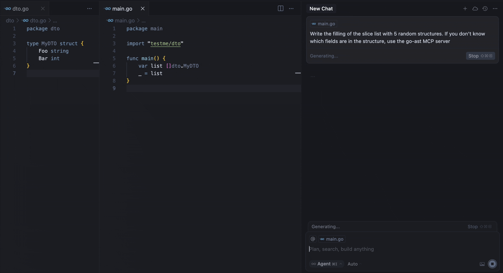

# AST2LLM for Go 

[](LICENSE) [](LICENSE) [](LICENSE) [](https://github.com/vprud/ast2llm-go/actions/workflows/ci.yml)

**Local AST-powered context enhancement tool for LLM**  

Automatically injects relevant code structure into your prompts using precise Go AST analysis.



Our MCP server provides the `parse-go` tool that:

1. Analyzes your Go project structure
2. Identifies external type declarations
3. Packages context for LLM prompts
4. Delivers 3-5x faster context resolution than grap-based approaches

For example, the demo above shows the model calling the tool to get the missing information about the fields of the `MyDTO` structure. In response, the model received all the necessary information from the response:

```
Used Imported Structs (from this project, if available):
  Struct: testme/dto.MyDTO
    Fields:
      - Foo string
      - Bar int
```

## Requirements

- Go 1.22 or higher (if building from source)
- Supported MCP client (Cursor, Claude, VS Code, etc.)

## Installation

### Binaries

To install `ast2llm-go` on your system, run the following command in your terminal:

```bash
curl -LsSf https://raw.githubusercontent.com/vprud/ast2llm-go/main/install.sh | sh
```

This script will automatically detect your OS and architecture, download the appropriate binary, and attempt to add it to your PATH. You can also specify an installation directory:

```bash
curl -LsSf https://raw.githubusercontent.com/vprud/ast2llm-go/main/install.sh | sh -s -- --install-dir /usr/local/bin
```

### Self-Update

To update `ast2llm-go` to the latest version, simply re-run the installation command:

```bash
curl -LsSf https://raw.githubusercontent.com/vprud/ast2llm-go/main/install.sh | sh
```

## Uninstallation

To remove `ast2llm-go` from your system, run the uninstallation script:

```bash
curl -LsSf https://raw.githubusercontent.com/vprud/ast2llm-go/main/uninstall.sh | sh
```

This script will remove the binary, clean up PATH modifications, and delete related configuration files. You may need to restart your shell after uninstallation.

## Setup in Clients

After installation `ast2llm-go`, you need to restart the IDE.

### Cursor

Add to your `~/.cursor/mcp.json`:

```json
{
  "mcpServers": {
    "go-ast": {
      "command": "ast2llm-go",
      "args": []
    }
  }  
}
```

### Claude Desktop

Add to `claude_desktop_config.json`:

```json
{
  "mcpServers": {
    "go-ast": {
      "command": "ast2llm-go"
    }
  }
}
```

### Visual Studio Code

Add to your VS Code MCP config:

```json
{
  "servers": {
    "go-ast": {
      "type": "stdio",
      "command": "ast2llm-go"
    }
  }
}
```

## Note About Current State
This MCP server is under active development and may have stability issues or incomplete functionality. We're working hard to improve it, but you might encounter:

- Occasional parsing errors
- Limited type support in current version
- Performance bottlenecks with large codebases

**Found an issue?**  
[Open a GitHub Issue](https://github.com/vprud/ast2llm-go/issues/new) to help us improve! We appreciate all bug reports and feature requests.

## Roadmap

### Language Support
- [x] Support for struct types
- [x] Support for interface types
- [x] Support for function types
- [ ] Support for global variables

### Multi-file Context
- [ ] Analyze multiple open files simultaneously
- [x] Cross-file dependency resolution
- [ ] Context-aware import optimization

### AST Representation
- [ ] Improved type hierarchy visualization
- [ ] Research optimal AST representation for LLMs

### Performance
- [ ] Incremental parsing
- [ ] AST caching
- [ ] Parallel analysis

## Contributing

We welcome contributions! Here's how you can help:

1. **Report Bugs**
   - Open an issue with a clear description
   - Include steps to reproduce
   - Add relevant logs/screenshots

2. **Suggest Features**
   - Open an issue with the feature request
   - Explain the use case and benefits
   - Include any relevant examples

3. **Submit Pull Requests**
   - Fork the repository
   - Create a feature branch
   - Add tests for new functionality
   - Ensure all tests pass
   - Submit a PR with a clear description
